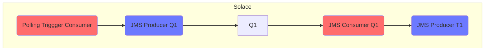

# Solace Testing

Project tests interlok-solace features

## What it does

This project contains a single instance of Interlok that will attempt to connect to locally running Solace instance.  It is assumed Solace can be contacted on tcp://localhost:55555.  Once started a single polling trigger will produce a message every 10 seconds and send that message to a queue named "Sample.Q1" on your Solace VPN.  
A second channel will consume the JMS message and it to another queue named "Sample.T1".

There is a further 2 channels, both of which do not start-up by default.  You'll need to log-in to the Interlok UI and start the required channel.

The second channel uses the JCSMP API rather than the standard JMS API, but again will transfer messages from Sample.Q1 to Sample.T1.

The third channel mixes the JMS API for consuming and the JCSMP API for producing.

 
## Getting started

Before starting Interlok you need to create a Solace docker container with

* `docker-compose up`

Then start Interlok

* `./gradlew clean build`
* `(cd ./build/distribution && java -jar lib/interlok-boot.jar)`

## Notes

The Solace Management Console UI starts up on port 8082, so as not to clash with Interlok UI running on port 8080.
